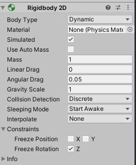
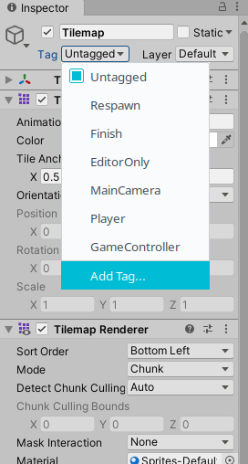
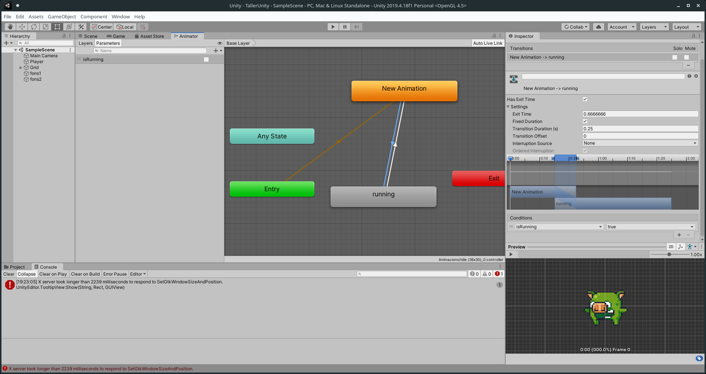

# Donant vida al pesonatge

Si fem click al botó de *Play*, veurem que el personatge està animat, però *vola* sobre l'escena. Això es deu a que ara per ara, no li hem afegit cap component que controle la física ni interactúe amb la resta d'elements.

Així, el primer que haurem de fer és dir que es tracta d'un cos rígid en 2D. Per a això:

1. Seleccionem el personatge, 
2. fem click al botó *Add Component* de l'inspector.
3. Busquem el component *Physics 2D* > *rigibody 2D*.

Amb aquests senzills pasos, ja hem fet que el nostre personatge es vega afectat per la gravetat. 

Si fem click al Play, vorem com aquest cau... i de fet, no es para... 

Per a això, necessitem que el nostre pesonatge *interactúe* amb l'entorn, o el que és el mateix, *detecte* quan *xoca* amb altre element del joc. Això s'aconsegueix amb el component *Box Collider*. Seguim els mateixos passos que abans:

1. Seleccionem el personatge, 
2. fem click al botó *Add Component* de l'inspector.
3. Busquem el component *Physics 2D* > *Box Collider 2D*.

Cal anar amb compte, no triar un *Box Collider* que no siga 2D, perquè aquest és incompatible amb el *Rigibody 2D* que hem triat.

Si tornem a fer click al Play, veurem que el personatge segueix caient, això es deu a que no hem dit encara que el TileMap també ha de detectar les col·lissions. Per a això, utilitzarem el component *Tilemap Collider 2D*:

1. Seleccionem el *Tilemap* de dins el *Grid* en la subfinestra d'escena,
2. fem click al botó *Add Component* de l'inspector.
3. Busquem el component *Physics 2D* > *Tilemap Collider 2D*.

Amb això, directament, es creen col·lissionadors per a cada element que hajam posat al mapa.

Ara sí, si fem click al play, veurem que el personatge ja es para quan arriba a terra.

>
> **Per fer:**
>
> Afegim també un *Rigibody 2D* i un *Collider* a l'enemic.
>

## Afegint interacció

Ha arribat l'hora de *picar* un poc de codi per interactuar amb el personatge.

Per a això, com que encara no tenim cap script creat, anem a crear una carpeta anomenada *Scripts* als nostres *Assets*:

1. Ens ubiquem en la carpeta d'Assets del nostre projecte (finestra *Project*)
2. Fem clic amb el botó dret dins d'Assets i en el menú desplegable seleccionem *Crete* > *Folder*
3. Li donem per nom *Scripts* a la nova carpeta

Ara ens ubiquem dins d'ella i creem un script (botó dret > *Create* > *C# Script* ), i li posem el nom de *Personatge*.

Si fem doble clic en aquest script, ens obrirà l'script un editor de text (o ens demanarà amb quin editor de text obrir-lo). Aquest Script té el següent contingut:

```cs
using System.Collections;
using System.Collections.Generic;
using UnityEngine;

public class Personatge : MonoBehaviour
{
    // Start is called before the first frame update
    void Start()
    {
        
    }

    // Update is called once per frame
    void Update()
    {
        
    }
}
```


Aci caldria parlar un poc del GameLoop, o bucle del joc. A grans trets, es tracta del bucle dins el qual s'executa tot el joc, i que passa per diferents fases: Inicialització, ACtualització de les propietatsdels personatges, fisiques, posicions,detecció de tecles, col·lissions, renderitzat de l'escena en pantalla, etc. El funcionament és senzill: en cadascuna d'estes fases, es llancen events que podem capturar en els nostres scripts. En aquest cas, per defecte, ens apareixen dos mètodes: `Start`, que detecta l'event d'inici del bucoe, i el mètode `Update`, que s'executa abans de renderitzar cada *frame* del joc.

Així doncs, anem a afegir a dins d'aquest mètode el següent codi:

```cs
 void Update()
{
    if (Input.GetKey(KeyCode.A) || Input.GetKey(KeyCode.LeftArrow)){
        //Movem a l'esquerra
            transform.Translate(new Vector2(-0.02f, 0.0f));
    }

    if (Input.GetKey(KeyCode.D) || Input.GetKey(KeyCode.RightArrow)){
        //Movem a la dreta
        transform.Translate(new Vector2(0.02f, 0.0f));
    }

    if (Input.GetKeyDown(KeyCode.W) || Input.GetKeyDown(KeyCode.UpArrow)){
        //Botem
        if (GetComponent<Rigidbody2D>()!=null){
        GetComponent<Rigidbody2D>().AddForce(new Vector2(0.0f, 200.0f));
        }
    }
}
```

Tingueu en compte que hem creat l'script, però no l'hem associat al personatge. Podem fer-ho fàcilment arrossegant l'script al personatge, per a que ens cree un component de tipus Script.

### Què hem fet per moure el personatge?

Per moure el personatge, en primer lloc detectem la polssació de les tecles mitjançant `Input.GetKey(KeyCode.CodiTecla)`.

Per moure a esquerra i dreta (amb les fletxes i la `A` i la `D`) afegim una transformació de traslació. Fixeu-vos que utilitzem vectors 2D per fer estes transformacions. 

Per tal de fer el bot, el que fem és afegir-li una força cap amunt, concretament al component *Rigibody* del personatge, que recordem que és el que s'encarrega de les físiques.

Proveu a executar ara el joc, i fixeu-vos en el seu comportament:

* El personatge *rota* quan xoca amb els objectes,
* Podem botar de forma *infinita*,
* L'animació del personatge segueix sent com si estigués quiet.

Veiem com resoldre cadascuna d'estes coses.

**Evitant les rotacions del personatges**

El motor de físiques provoca que quan l'objecte col·lissiona amb altres, es produisquen rotacions en aquest. Estes rotacions les podem eliminar afegint al component `Rigibody 2D` la restricció (*Constraint*) de *Congelar* les rotacions en l'eix Z:



**Evitant bots infinits**

Per tal d'evitar que es puga botar en l'aire, simplement hem de controlar que el personatge no estiga en l'aire quan bote. Exiteixen diverses formes. Anem a vore una forma de fer-ho mitjançant etiquetes.

El primer que farem és afegir una nova etiqueta al *TileMap*. Per a això:

1. Seleccionem el Tilemap,
2. Localitzem a l'inspector l'etiqueta *Tag* i despleguem el menú
3. Seleccionem *Add Tag*



4. Fem clic al `+` per afegir una nova etiqueta, i li posem per nom *Plataformes*.
5. Assegurem-nos que el TileMap té l'etiquets que hem creat seleccionada

Una vegada fet açò, afegirem les següent modificacions al codi del nostre personatge:

* Afegim un camp anomenat `jumping` al personatge:

```cs
public class Personatge : MonoBehaviour
{
    public Boolean jumping {get;set;}
...}
```

* Al mètode `Start()` inicialitzarem aquest valor a a *false*.

```cs
void Start()
    {
        jumping=false;
    }
```

I al mètode `Update`, modificarem el codi per a que tinga en compte si s'està botant:

```cs
 if (Input.GetKeyDown(KeyCode.W) || Input.GetKeyDown(KeyCode.UpArrow)){
    //Botem
    if (GetComponent<Rigidbody2D>()!=null && !jumping){
    jumping=true;
    GetComponent<Rigidbody2D>().AddForce(new Vector2(0.0f, 300.0f));
    }
}
```

A més, haurem d'afegir una miqueta més de codi per detectar quan el personatge *toca terra* per poder tornar a botar. Implementarem el mètode `OnCollisionEnter2D`:

```cs
void OnCollisionEnter2D(Collision2D _col){
    //Entra si dos objectes col·lisionen per primera vegada
    if(_col.gameObject.tag == "Plataformes" && _col.contacts[0].normal.y>=0)
        jumping = false;
}
```

**Animant el personatge quan corre**

Ara ens queda poder animar el personatge quan corre. Per a això hem d'editar el diagrama d'estats per afegir un nou estat *isRunning*.

Per a això, en primer lloc incorporarem l'animació del personatge caminant a l'escena i la guardarem a la nostra carpeta d'animacions.

Una vegada la tenim en esta carpeta, obrim la pestanya *Animator* i l'arrosseguem allí, creant un nou estat en el diagrama d'estats. En aquest, haurem d'afegir transicions entre l'estat de repòs (New Animation) a Running. A més, afegirem una propietat de tipus Booleana que es diga isRunning, i l'associarem a les transicions com a condicions.



Ara, només ens quedarà gestionar per codi aquestes transicions, mitjançant la modificació d'aquesta propietat `isRunning` del component Animator.

A més, aprofitarem per gestionar quan camina cap a un costat o cap a altre, ja que l'animació sempre mira a l'esquerra, caldrà detectar si s'està caminant cap a un sentit o cap a altre i afegir una transformació.

El codi en general serà:

* Ens definim dos camps més al personatge:

```cs
private Animator anim;
private Boolean lookingLeft;
```

* Al mètode Start els inicialitzem. `anim` serà una referència al component `Animator` del personatge.

```cs
void Start()
{
    jumping=false;
    anim = gameObject.GetComponent<Animator>();
    lookingLeft=true;
}
```

* I després, modificarem el mètode `Update`, de manera que si s'estan prement les tecles de caminar, actualitzem el paràmetre `isRunning` de l'animació. A més, també controlarem aci si cal afegir alguna transformació per a que el personatge mire cap al costat cap al que camina:

```cs

if (Input.GetKey(KeyCode.A) || Input.GetKey(KeyCode.LeftArrow)){
    //Movem a l'esquerra
    transform.Translate(new Vector2(-0.02f, 0.0f));
    anim.SetBool ("isRunning", true);
            
    // Si no està mirant a l'esquerra, li afegim la transició
    if (!lookingLeft) 
    {
        transform.localScale *= new Vector2(-1,1);
        lookingLeft=true;
    }
}
```

```cs
if (Input.GetKey(KeyCode.D) || Input.GetKey(KeyCode.RightArrow)){
    //Movem a la dreta
    transform.Translate(new Vector2(0.02f, 0.0f));
    anim.SetBool ("isRunning", true);
            
    if (lookingLeft) 
    {
        transform.localScale *= new Vector2(-1,1);
        lookingLeft=false;
    }
}
```


