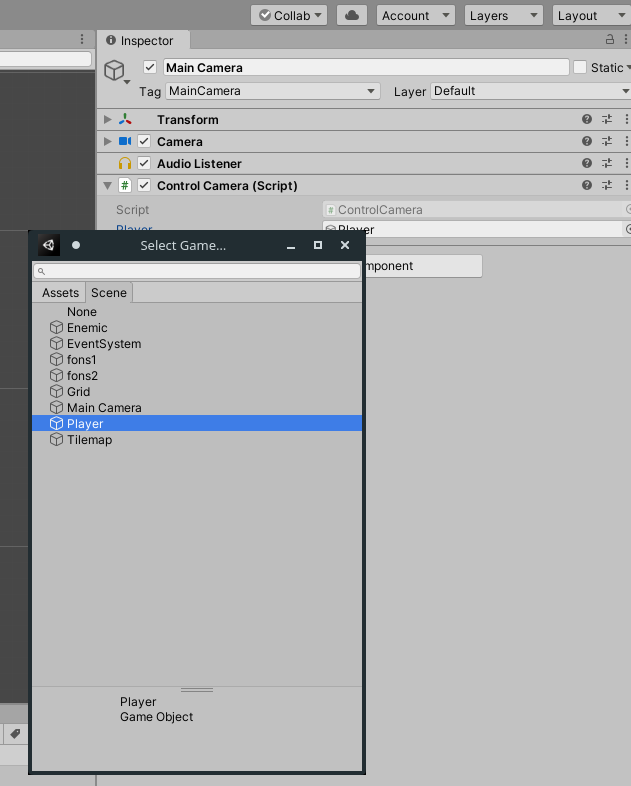

# Movent la càmera

Com veureu, el personatge pot seguir botant cap amunt, però la càmera no acompanya aquest moviment. Anem a fer que aquesta es moga en funció de la posició del jugador, de maner que aquest sempre estiga aliniat. Per a això, afegirem a la càmera el següent script:

```cs
using System.Net.Mime;
using System.Collections;
using System.Collections.Generic;
using UnityEngine;

public class ControlCamera : MonoBehaviour
{
    public GameObject player;
    private Vector3 position;
    // Start is called before the first frame update
    void Start()
    {
        position=transform.position - player.transform.position;
    }

    // Update is called once per frame
    void Update()
    {
        transform.position=player.transform.position + position;
    }
}
```

Amb açò, generem un objecte global que farà referència al jugador, i al que associarem a la interfície.

.

Fet açò, ja podrem moure el personatge i la càmera seguirà el moviment d'aquest.

