 __Unity__ 

 __Game examples__ 

 __Vicent Selfa__ 

 __Curs 2020/2021__ 

 __Third person games__ 

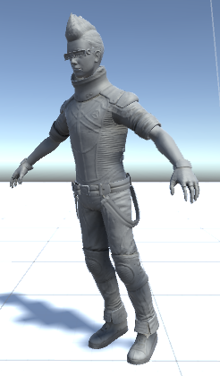

 __Third person games__ 

 __Third person games__ 

 __Copy__   and   __paste__   the previous scene\, so we are keeping all the previous game objects\.

Then rename the new scene as   __ThirdPerson__ 

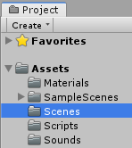

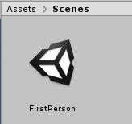

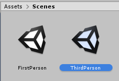

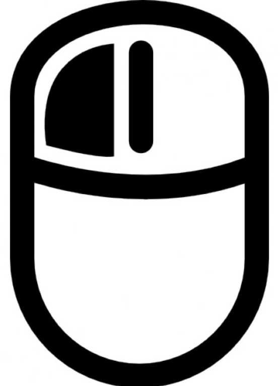

 __Third person games__ 

Remove the RigidbodyFPSController game object

And add a   __ThirdPersonController__   game object

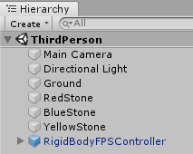

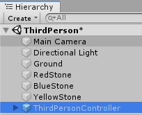

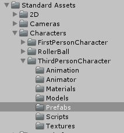

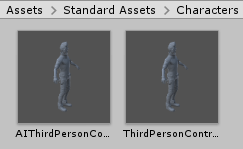

 __Third person games__ 

The new   __ThirdPerson__   scene

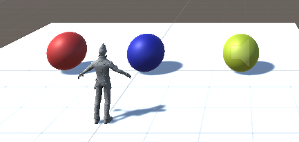

 __Third person games__ 

 __Playing third person games: Destroying\, impelling or getting stones__ 

The scrip to manage the third person character:   __ThirdPersonController__ 

Modify the   __ThirdPersonUserControl\.cs__   to manage the next situations:

If you collide a   __red stone destroy__   it

If you collide a   __yellow stone\, make it an impulse__ 

If you collide a   __blue stone\, make it to follow you__ 

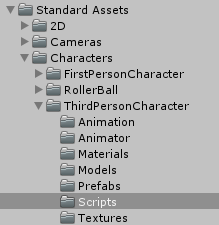

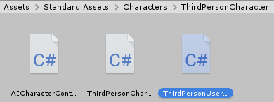

 __Third person games__ 

 __Playing third person games: Destroying\, impelling or getting stones__ 

The  script  to manage the third person character:   __ThirdPersonController__ 

// References to the 3 stones using public variables

 __public GameObject blueStone;__ 

 __public GameObject redStone;__ 

 __public GameObject yellowStone;__ 

 __private void OnCollisionEnter\(Collision collision\)         \{__ 

if \(collision\.gameObject\.tag == "   __RedStone__   "\)     \{   __Destroy\(collision\.gameObject\);\}__ 

if \(collision\.gameObject\.tag == "   __BlueStone__   "\)    \{   __blueStone\.SendMessage\("Follow"\);__   \}

if \(collision\.gameObject\.tag == "   __YellowStone__   "\) \{   __yellowStone\.SendMessage\("Impuls"\);__   \}

\}

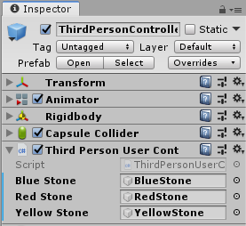

 __Third person games__ 

 __Playing third person games: Destroying\, impelling or getting stones__ 

 __public class StoneController : MonoBehaviour \{__ 

// To follow an object keeping an offset distance

 __public GameObject target;__ 

private Vector3 offset; // The object to follow and the distance

private bool following = false;  private Rigidbody rigidBody;

 __void Start \(\)__   \{   __rigidBody = GetComponent\<Rigidbody>\(\);__   \}

 __void Update \(\) \{    \}__ 

 __void Follow\(\) \{__ 

 __offset = transform\.position \- target\.transform\.position;   following = true;__ 

\}

 __void LateUpdate\(\)     \{__ 

 __if \(following\)__   \{

// To update the position of the camera AFTER the update of the sphere

 __transform\.position = target\.transform\.position \+ offset;__ 

\}

\}

 __void Impuls\(\)    \{__ 

 __rigidBody\.AddForce\(Vector3\.forward \* Random\.Range\(1\, 5\)\, ForceMode\.Impulse\);__ 

\}

\}

 __Third person games__ 

 __Playing third person games: Destroying\, impelling or getting stones__ 

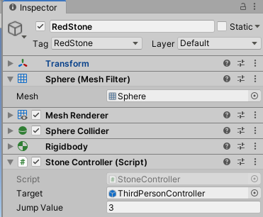

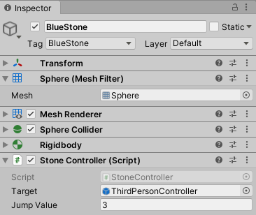

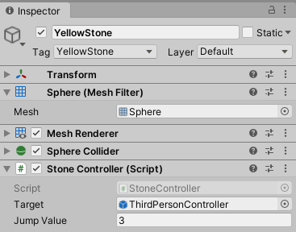

 __Third person games__ 

Another way of programming all the actions\, using   __ONLY__   a   __TPStoneController__    __script__ 

 __public class TPStoneController : MonoBehaviour__   \{ // Only ONE class to control all the stones

private Rigidbody   __rigidBody__   ; private Vector3   __offset__   ;    // The distance

private bool   __following__   = false;   public GameObject   __target__   ; // The target to follow

 __void Start\(\)  \{__ 

rigidBody = GetComponent\<Rigidbody>\(\); offset = gameObject\.transform\.position \- target\.transform\.position;

\}

 __void OnCollisionEnter\(Collision other\) \{__   // Interacting with the First and Third Person Controllers

// The only one change required

 __if \(other\.gameObject\.tag == “TPCTag"\) \{__ 

if \(gameObject\.tag == "   __RedStoneTag__   "\) \{ print\("Xoc amb la bola roja\!\!"\);   __Destroy \(gameObject\);__   \}

if \(gameObject\.tag == "   __BlueStoneTag__   "\) \{

if \(\!following\) \{   __following = true;__   print\("Xoc amb la bola blava\!\!"\);

 __offset = gameObject\.transform\.position \- target\.transform\.position;__ 

\}

\}

if \(gameObject\.tag == "   __YellowStoneTag__   "\) \{ print\("Xoc amb la bola groga\!\!"\);

rigidBody\.AddForce\(Vector3\.forward \* Random\.Range\(1\, 5\)\, ForceMode\.Impulse\);

\}

 __ControlCollisions\.incNumCollisions\(\);__   print\("Num\. colisions: " \+ ControlCollisions\.getNumCollisions\(\)\);

\}

\}

 __void LateUpdate\(\)__   \{ // To update the position of the camera AFTER the update of the sphere

if \(   __following__   \)\{

if \(gameObject\.tag == "   __BlueStoneTag__   "\) \{gameObject\.transform\.position = target\.transform\.position \+ offset;\}

\}

\}

\}

 __Third person games__ 

Another way of programming all the actions\, using   __ONLY__   a   __TPStoneController__    __script__ 

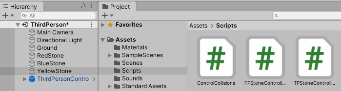

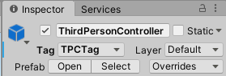

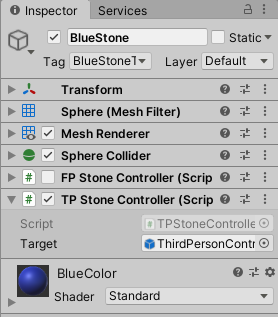

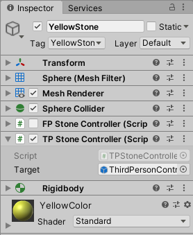

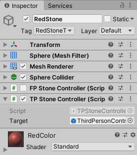

 __First person games__ 

 __Playing using the first person__ 

Are those in which   __the camera is put in the eyes of the player\,__   so   __we do not see anything of him__   \.

We only could see in some cases the hands or the weapons that this character is holding\.

Therefore\, we see all reality only and exclusively from his eyes\, I mean\, the camera are the eyes of the player

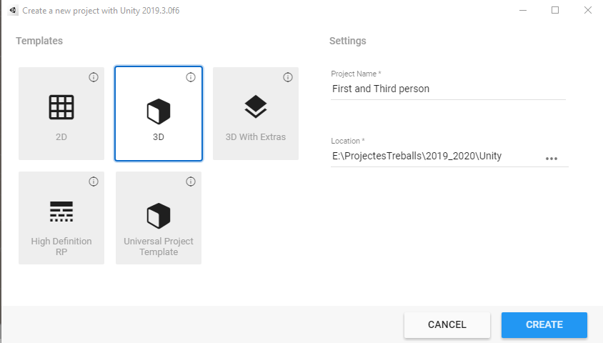

 __First person games: Layout__ 

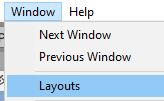

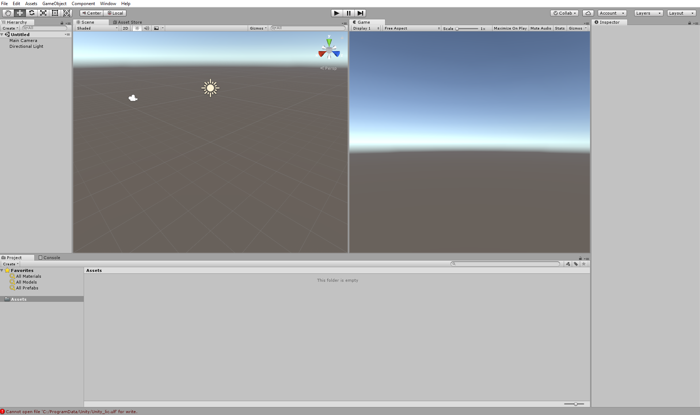

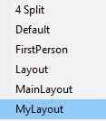

 __First person games: Assets__ 

Importing   __assets__ 

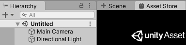

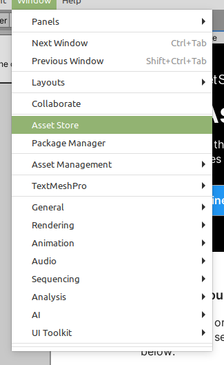

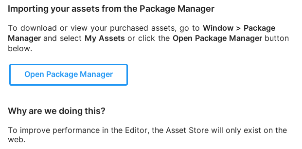

 __First person games: Import packages__ 

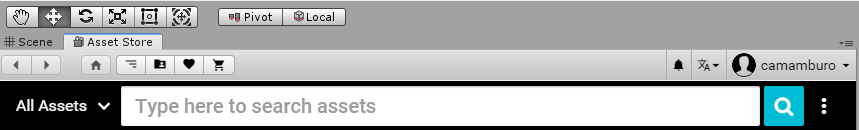

 __First person games: Import packages__ 

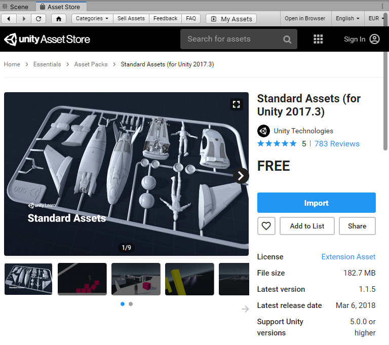

 __First person games: Import packages__ 

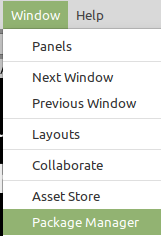

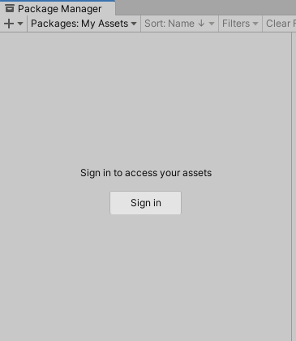

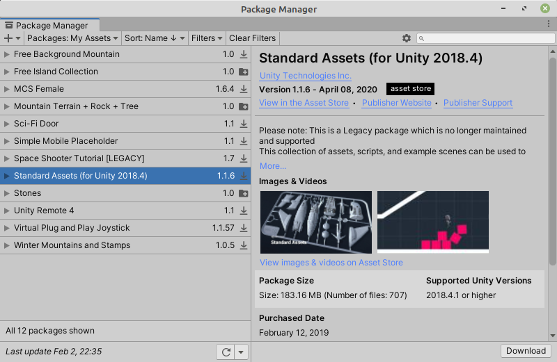

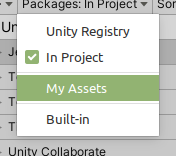

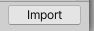

 __First person games: Import packages__ 

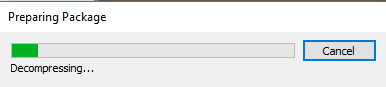

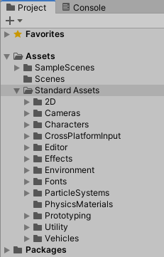

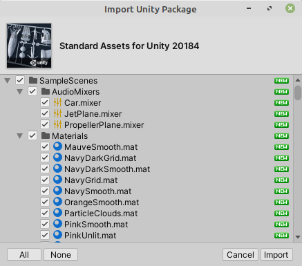

Best option: Install   __all the components__   to avoid missing references

 __First person games:__ 

 __Materials\, ground\, spheres …__ 

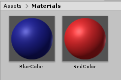

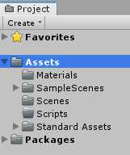

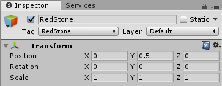

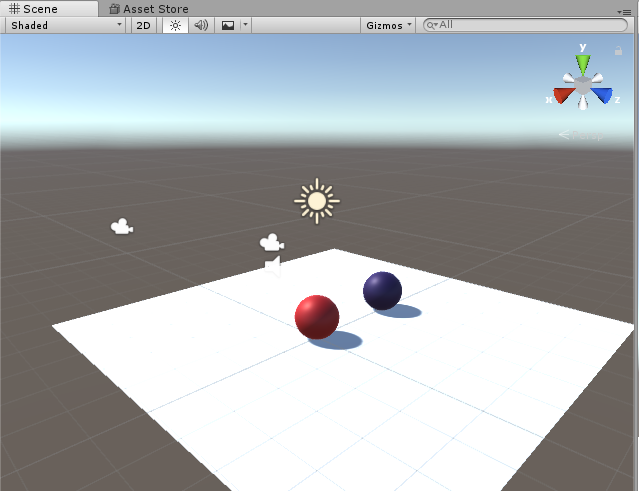

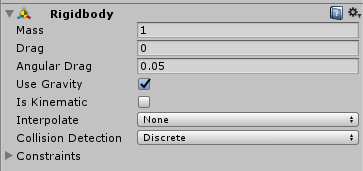

 __First person games:__ 

 __The first person prefab\.__ 

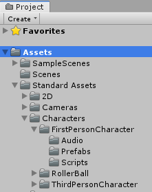

 __Our first person prefab__ 

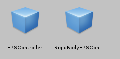

 __First person games:__ 

 __The first person prefab\.__ 

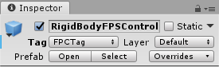

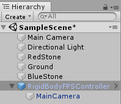

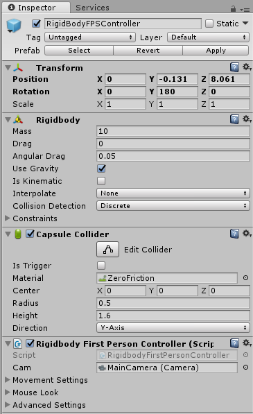

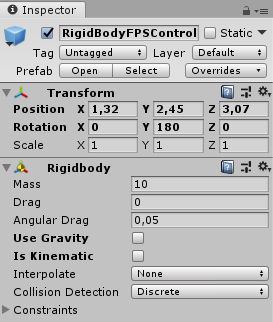

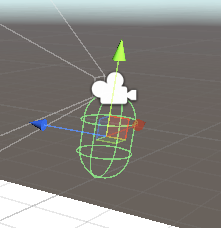

 __Try unchecking Use Gravity\. What’s the difference?__ 

 __First person:__    __Playing the game\!__ 

 __Attention\.\- How to solve:__ 

 __Unity error__   CS0619: 'GUITexture' is obsolete: 'GUITexture has been removed\. Use UI\.Image instead\.'

Unity Component at index 2 could not be loaded when loading gameobject 'Main Camera'\. Removing it\!

 __SimpleActivatorMenu\.cs__ 

using System;

using UnityEngine;

 __using UnityEngine\.UI;  // For the Text class__ 

namespace UnityStandardAssets\.Utility

\{

public class SimpleActivatorMenu : MonoBehaviour

\{

// An incredibly simple menu which\, when given references

// to gameobjects in the scene

//   __public GUIText camSwitchButton;__ 

 __public Text camSwitchButton;__ 

public GameObject\[\] objects;

// More code

\}

using System;

using UnityEngine;

using UnityEngine\.SceneManagement;

using UnityStandardAssets\.CrossPlatformInput;

 __using UnityEngine\.UI;  // For the Text class__ 

 __// \[RequireComponent\(typeof \(UI\.Text\)\)\]__ 

public class ForcedReset : MonoBehaviour

\{

// More code

\}

Another solution for this problems   _[here](http://learntocreategames.com/importing-and-using-standard-assets-with-unity-2020/)_ 

 __First person:__    __Playing the game\!__ 

Run the game\, move across the ground using   __arrows__   \,   _w\-a\-s\-d_   keys or   __space bar__   \.

After a few moments of playing… try to exit from the play mode\!

Could be this keys can help you:

 __First person games__ 

 __Exercise: Destroy the ball\. The script on the first person character__ 

The game object:   __A first person character__ 

The  script  to manage the first person character:   __RigidbodyFirstPersonController__ 

 __First person games__ 

 __Exercise: Destroy the ball\.__    __The code on the first person character script__ 

The scrip to manage the first person character:   __RigidbodyFirstPersonController__ 

 __namespace UnityStandardAssets\.Characters\.FirstPerson\{__ 

\[RequireComponent\(typeof \(Rigidbody\)\)\]

\[RequireComponent\(typeof \(CapsuleCollider\)\)\]

 __public class RigidbodyFirstPersonController : MonoBehaviour__   \{

 __private void OnCollisionEnter\(Collision collision\) \{__ 

if \(collision\.gameObject\.tag == "   __RedStoneTag__   "\) \{

print\("Xoc amb la bola roja\!\!\!"\);

 __Destroy\(collision\.gameObject\);__ 

\}

\}

// More code  …

 __First person games__ 

 __Exercise: Destroy the ball\.__ 

 __First person games__ 

 __Exercise: Follow the First Person Character after colliding with it__ 

The game objects:   __Tag the blue stone__ 

The scripts:   __RigidbodyFirstPersonController__ 

// Add the next code into the   __OnCollisionEnte__   r method

 __if \(collision\.gameObject\.tag == "BlueStoneTag"\)    \{__ 

 __blueStone\.SendMessage\("Follow"\);__ 

 __\}__ 

// And add the next attribute

 __public GameObject blueStone;__ 

 __First person games__ 

 __Exercise: Follow the First Person Character after colliding with it__ 

The scripts:   __StoneController__ 

 __First person games__ 

 __Exercise: Follow the First Person Character after colliding with it__ 

The script:   __StoneController\.__   Methods   __: Follow and LateUpdate__ 

* public class   __StoneController__   : MonoBehaviour \{
  * // To follow an object keeping an offset distance
  *  __public GameObject target__   ; // The first person object to follow
  *  __private Vector3 offset__   ; // The distance
  *  __private bool following = false__   ;   __private Rigidbody rigidBody;__ 
* // Use this for initialization
*  __void Start\(\)  \{ 	rigidBody = GetComponent\<Rigidbody>\(\);     \}__ 
* // Update is called once per frame
* void Update\(\) \{ \}
*  __void Follow\(\) \{__   // Initial values when a message is sent to Follow
*  __offset = transform\.position \- target\.transform\.position;__ 
*  __following = true;__ 
*  __\}__ 
*  __void LateUpdate\(\) \{__   // To move the càmera AFTER the sphere
*  __if \(following\)\{__ 
* // To update the position of the camera AFTER the  update of the sphere
*  __transform\.position = target\.transform\.position \+ offset;__ 
*  __\}__ 
*  __\}__ 
* \}

 __First person games__ 

 __Exercise: Follow the First Person Character after colliding with it__ 

 __After__ 

 __OnCollisionEnte__   r

 __Before__ 

 __OnCollisionEnte__   r

 __First person games__ 

 __Exercise: Making an impulse to the yellow stone after colliding with it__ 

 __First person games__ 

 __Exercise: Making an impulse to the yellow stone after colliding with it__ 

The script:   __RigidbodyFirstPersonController\.__ 

Modify this method adding a code to call the method   __Impuls__   \(\)\, using SendMessage\(\)\.

 __public GameObject yellowStone;__ 

 __private void OnCollisionEnter\(Collision collision\)__   \{

 __if \(collision\.gameObject\.tag == "YellowStone"\)    \{__ 

 __yellowStone\.SendMessage\("Impuls"\);__ 

 __\}__ 

\}

 __First person games__ 

 __Exercise: Making an impulse to the stone after colliding with it__ 

The script:   __StoneController\.__   Method   __: Impuls__ 

 __public int jumpValue = 3;__ 

 __void Impuls\(\) \{__ 

 __rigidBody\.AddForce\(Vector3\.up \* jumpValue\, ForceMode\.Impulse\);__ 

 __\}__ 

 __First person games__ 

 __Exercise: Making an impulse to the stone after colliding with it__ 

 __Add sounds to the different actions__ 

 __private AudioSource audioSourceBoing;__   // The sound for the impulse

 __void Start\(\)  \{__ 

rigidBody = GetComponent\<Rigidbody>\(\);

 __audioSourceBoing = GetComponent\<AudioSource>\(\);__ 

\}

 __void Impuls\(\)  \{__ 

rigidBody\.AddForce\(Vector3\.up \* jumpValue\, ForceMode\.Impulse\);

 __audioSourceBoing\.Play\(\);__ 

\}

 __First person games__ 

Another way of programming all the actions\, using   __ONLY__   a   __FPStoneController script__ 

 __public class FPStoneController : MonoBehaviour__   \{ // Only ONE class to control all the stones

private Rigidbody   __rigidBody__   ; private Vector3   __offset__   ;    // The distance

private bool   __following__   = false;   public GameObject   __target__   ; // The target to follow

 __void Start\(\)  \{__ 

rigidBody = GetComponent\<Rigidbody>\(\); \}

 __void OnCollisionEnter\(Collision other\) \{__ 

 __if \(other\.gameObject\.tag == "FPCTag"\) \{__   // Interacting ONLY with the First Person Controller

if \(   __gameObject\.tag__   == "   _RedStoneTag_   "\) \{ print\("Xoc amb la bola roja\!\!"\);   __Destroy \(gameObject\);__   \}

if \(   __gameObject\.tag__   == "   __BlueStoneTag__   "\) \{

if \(\!   __following__   \) \{   __following = true;__   print\("Xoc amb la bola blava\!\!"\);

 __offset = gameObject\.transform\.position \- target\.transform\.position;__ 

\}

else \{                  print\("Seguint bola blava\!\!"\);                  \}

\}

if \(   __gameObject\.tag ==__   "   __YellowStoneTag__   "\) \{ print\("Xoc amb la bola groga\!\!"\);

rigidBody\.AddForce\(Vector3\.forward \* Random\.Range\(1\, 5\)\, ForceMode\.Impulse\);

\}

 __ControlCollisions\.incNumCollisions\(\);__   print\("Num\. colisions: " \+ ControlCollisions\.getNumCollisions\(\)\);

\}

\}

 __void LateUpdate\(\)__   \{ // To update the position of the camera AFTER the update of the sphere

if \(   __following__   \)\{

if \(gameObject\.tag == "   __BlueStoneTag__   "\) \{gameObject\.transform\.position = target\.transform\.position \+ offset;\}

\}

\}

\}

 __First person games__ 

Another way of programming all the actions\, using   __ONLY__   a   __FPStoneController script__ 

The static class   __ControlCollisions\.cs__ 

 __public static class ControlCollisions \{__ 

 __private static int numCollisions = 0;__ 

 __public static void incNumCollisions \(\) \{__ 

 __numCollisions\+\+;__ 

 __\}__ 

 __public static int getNumCollisions \(\) \{__ 

 __return numCollisions;__ 

 __\}__    __\}__ 

 __First person games__ 

Another way of programming all the actions\, using   __ONLY__   a   __FPStoneController script__ 

 __A game with scenes__ 

 __Creating the Awake and Final scene__ 

 __A game with scenes__ 

 __Our first scene: Awake__ 

 __A child of Canvas__ 

 __A game with scenes__ 

 __Our first scene\.\- Awake with buttons inside the canvas: FPButton__ 

 __A game with scenes__ 

 __Adding music to the first scene__ 

 __Exercise: Add different kind of songs to the different actions\.__ 

 __A game with scenes__ 

 __Our first scene\.\- Awake with buttons: TPButton__ 

 __A game with scenes__ 

 __The script to manage the scenes: InterfaceAwake\.cs__ 

using System\.Collections;

using System\.Collections\.Generic;

using UnityEngine;

 __using UnityEngine\.SceneManagement;__ 

 __public class InterfaceAwake : MonoBehaviour \{__ 

 __public void GoFirstPerson \(\)    \{__ 

 __SceneManager\.LoadScene \("FirstPerson"\);__ 

 __\}__ 

\}

 __A game with scenes__ 

 __Linking the button with the InterfaceAwake: Selecting the object__ 

 __A game with scenes__ 

 __Linking the button with the InterfaceAwake\.\- Selecting the method:__ 

 __Exercise: Create a new method GoThridPerson\(\) and link it to the second button__ 

__If you try to run the game now there will appear an__  __error__  __:__

__To add a scene to the build settings use the menu File\->Build Settings\.\.\.__

 __A game with scenes__ 

 __Our Final scene with a button\. Add a Canvas with a button:__ 

 __A game with scenes__ 

 __Putting all the scenes together and running the game from the Awake scene__ 

Open the scenes and add them using the button

 __A game with scenes__ 

 __Putting all the scenes together and running the game from the Awake scene__ 

 __Create a new folder for the game__ 

 __A game with scenes__ 

 __The final result__ 

 __Take a look to the final project__    _[here in GitHub](https://github.com/vselfa/FirstAndThirdPerson2)_ 

 __A game … with Android__ 

 __A game … with Android: The new platform__ 

 __Switching the platform__ 

 __A game … with Android: The new platform__ 

 __Switching the platform__ 

 __A game … with Android: The assets__ 

 __The Cross Platform Input assets__ 

 __A game … with Android: The assets__ 

 __A game with scenes … with Android__ 

 __The Project Settings for the Android platform\.__ 

 __A game … with Android__ 

 __Building the game for the Android platform\.__ 

 __Download the complete project__    _[here](https://drive.google.com/open?id=19L8l7fXwPH3VuhBqHY-HWCUvjq55d_Jv)_ 

 __A game … with Android__ 

 __Building the game for the Android platform\.__ 

 __A game … with Android__ 

 __Building the game for the Android platform\.__ 

 __A game … with Android__ 

 __And playing the game in the mobile\!__ 

 __Destroy Stones__ 

 __Game__ 

 __Download the complete project__    _[here](https://drive.google.com/drive/folders/14lHrQlz5HYAN_EDYiUsHBDvElpRyhFyj?usp=sharing)_ 

 __Destroy Stones Game__ 

 __Creating a new game: DestroyStones__ 

Download the Destroy Stone game   _[here](https://drive.google.com/drive/folders/1ZL_ShNjJbMbvIu5U19dNpgv2mVmf9THX?usp=sharing)_ 

 __Destroy Stones Game__ 

Creating   __folders__ 

Saving the   __scene__ 

 __Destroy Stones Game__ 

Importing   __assets__ 

 __Destroy Stones Game__ 

Importing   __assets__ 

 __Destroy Stones Game__ 

Importing   __assets__ 

 __Destroy Stones Game__ 

 __Destroy Stones Game__ 

Creating   __prefabs__ 

The Stones   __prefabs__ 

The Stones   __prefabs__ 

 __Destroy Stones Game__ 

Creating   __scripts__ 

using UnityEngine;

using System\.Collections;

 __public class MainLoop : MonoBehaviour \{__ 

 __public GameObject\[\] stones = new GameObject\[3\];__   // An array of GameObjects

public float   __torque__   = 5\.0f; // Spacial force to provoque a rotation

// Different min and max values to give random to the stones

public float   __minAntiGravity__   = 20\.0f\,   __maxAntiGravity__   = 40\.0f;

public float   __minLateralForce__   = \-15\.0f\,   __maxLateralForce__   = 15\.0f;

public float   __minTimeBetweenStones__   = 1f\,   __maxTimeBetweenStones__   = 3f;

public float   __minX__   = \-5\.0f\,   __maxX__   = 5\.0f;

public float   __minZ__   = \-5\.0f\,   __maxZ__   = 5\.0f;

private bool   __enableStones__   = true;

private Rigidbody   __rigidBody__   ;

// Use this for initialization

 __void Start\(\)__   \{   __StartCoroutine\(ThrowStones\(\)\);__   \}

// To run the coroutine

 __IEnumerator ThrowStones\(\) \{   //TODO \}__ 

\}

 __Destroy Stones Game__ 

 __IEnumerator ThrowStones\(\) \{__ 

// Initial delay

 __yield return new WaitForSeconds\(2\.0f\);__ 

 __while \(enableStones\) \{__ 

// Random values for: the kind of stone\, position and rotation of the initial values

GameObject   __stone__   = \(GameObject\)   __Instantiate__   \(stones\[   __Random__   \.   __Range__   \(0\, stones\.Length\)\]\);

stone\.transform\.position = new Vector3\(   __Random__   \.   __Range__   \(minX\, maxX\)\, \-30\.0f\,

 __Random__   \.   __Range__   \(minZ\, maxZ\)\);

stone\.transform\.rotation = Random\.rotation;

 __rigidBody = stone\.GetComponent\<Rigidbody>\(\);__ 

rigidBody\.AddTorque\(Vector3\.   __up__   \* torque\, ForceMode\.Impulse\);

rigidBody\.AddTorque\(Vector3\.   __right__   \* torque\, ForceMode\.Impulse\);

rigidBody\.AddTorque\(Vector3\.   __forward__   \* torque\, ForceMode\.Impulse\);

rigidBody\.AddForce\(Vector3\.   __up__   \* Random\.Range\(minAntiGravity\, maxAntiGravity\)\,

ForceMode\.Impulse\);

rigidBody\.AddForce\(Vector3\.   __right__   \* Random\.Range\(minLateralForce\, maxLateralForce\)\,

ForceMode\.Impulse\);

// Next time to run the coroutine

 __yield return new WaitForSeconds\(Random\.Range\(minTimeBetweenStones\,__ 

 __maxTimeBetweenStones\)\);__ 

\}

\}

 __Destroy Stones Game__ 

Adding the script to the   __Main Camera__ 

 __Destroy Stones Game__ 

Adjusting the values of the Main Camera

Adjusting the   __Time Scale__ 

 __Destroy Stones Game__ 

A problem:

 __We never destroy the stones\!\!__ 

 __Destroy Stones Game__ 

 __Destroying__   the stones in a dynamically way

 __public class Stone: MonoBehaviour \{__ 

// Distance to the stone be destroyed

 __private const float yDie = \-30\.0f;__ 

// Use this for initialization

void Start \(\) \{ 	\}

// Update is called once per frame

 __void Update \(\) \{__ 

__// Position stone < yDie__

 __if \(transform\.position\.y < yDie\)  \{__ 

// Destroy the game to which this script is associated

 __Destroy\(gameObject\);__ 

 __\}__ 

 __\}__ 

\}

 __Destroy Stones Game__ 

 __Destroying__   the stones in a dynamically way

 __Destroy Stones Game__ 

Destroying the stones using the   __mouse\.__   Add   __colliders__   to the stones

 __Destroy Stones Game__ 

Destroying the stones using the   __mouse__ 

 __public class Stone: MonoBehaviour \{__ 

private const float yDie = \-30\.0f;

// Use this for initialization

void Start \(\) \{  \}

// Update is called once per frame

 __void Update \(\) \{__ 

 __if \(transform\.position\.y < yDie\)  \{__ 

 __Destroy\(gameObject\);__ 

\}

\}

 __void OnMouseDown\(\)\{__ 

// Detect if the object intercept the ray send by the mouse

 __Destroy\(gameObject\);__ 

\}

\}

 __Destroy Stones Game:__    __Explosion effect__ 

Adding realism to our game:   __Explosion effect using a Particle System__ 

Import the   __Standard Assets package__ 

 __Destroy Stones Game:__    __Explosion effect__ 

Import the   __Standard Assets package__ 

 __Destroy Stones Game__ 

Adding the explosion effect to the script: The code

using UnityEngine;

 __public class Stone: MonoBehaviour \{__ 

private const float yDie = \-30\.0f;

 __public GameObject explosion;__ 

// Use this for initialization

 __void Start \(\) \{  \}__ 

// Update is called once per frame

 __void Update \(\) \{__ 

if \(transform\.position\.y < yDie\)  \{   __Destroy\(gameObject\)__   ;    \}

\}

// Detect if the object  intercept  the ray

 __void OnMouseDown\(\) \{__ 

// Create an explosion effect here\, with no rotation

 __Instantiate\(explosion\, transform\.position\, Quaternion\.identity\);__ 

 __Destroy\(gameObject\);__ 

\}

\}

 __Destroy Stones Game:__    __Explosion effect__ 

Adding realism to our game:   __Explosion effect using a Particle System__ 

 __Destroy Stones Game__ 

Adding the   __explosion__   effect to the script

 __Destroy Stones Game__ 

Adding   __sound__   to the Background

 __Destroy Stones Game__ 

Adding   __sound__   to the explosions\.

 __DestroyStones Game__ 

 __Registering information about the game__ 

An special   __static class GameManager__ 

// A static class

 __public static class GameManger  \{__ 

 __public static int currentNumberStonesThrow = 0;__ 

 __public static int currentNumberStonesDestroyed = 0;__ 

 __\}__ 

 __IEnumerator ThrowStones\(\) \{__ 

// Initial delay

 __yield return new WaitForSeconds\(2\.0f\);__ 

 __while \(enableStones\) \{__ 

// More code

// Incrementing the number of stones thrown

 __GameManager\.currentNumberStonesThrow\+\+;__ 

yield return new

WaitForSeconds\(Random\.Range\(minTimeBetweenStones\,

maxTimeBetweenStones\)\);

\}

\}

 __DestroyStones Game__ 

 __Registering information about the game__ 

An special   __static class GameManager__ 

// An static class

 __public static class GameManager  \{__ 

 __public static int currentNumberStonesThrow = 0;__ 

 __public static int currentNumberStonesDestroyed = 0__ 

 __\}__ 

 __void OnMouseDown\(\)  \{__ 

// Create an explosion effect here\, with no rotation

Instantiate\(explosion\, transform\.position\, Quaternion\.identity\);

Destroy\(gameObject\);

 __GameManager\.currentNumberStonesDestroyed\+\+;__ 

\}

 __DestroyStones Game__ 

 __Showing the information of the game: Canvas__ 

 __DestroyStones Game__ 

 __Showing the information of the game: Canvas__ 

 __DestroyStones Game__ 

 __Showing the information of the game: Canvas__ 

// Complete the previous class adding the necessary code\.

 __using UnityEngine\.UI;  // For the Text class__ 

 __public Text numberStonesThrow\, numberStonesDestroyed;__ 

 __void Start\(\) \{__ 

 __numberStonesThrow\.text = "Stones thrown: ";__ 

 __numberStonesDestroyed\.text = "Stones destroyed: ";__ 

StartCoroutine\(   __ThrowStones__   \(\)\);

 __\}__ 

 __IEnumerator ThrowStones\(\) \{__ 

// Initial delay

 __yield return new WaitForSeconds\(2\.0f\);__ 

 __while \(enableStones\) \{__ 

// More code

// Incrementing the number of stones thrown

 __GameManager\.currentNumberStonesThrow\+\+;__ 

 __ShowStonesNumber \(\) ; // Showing the number of stones__ 

yield return new WaitForSeconds\(Random\.Range\(minTimeBetweenStones\,

maxTimeBetweenStones\)\);

\}

 __\}__ 

 __void ShowStonesNumber \(\) \{__ 

 __numberStonesThrow\.text = "Stones thrown: “ \+ GameManager\.currentNumberStonesThrow;__ 

 __numberStonesDestroyed\.text = "Stones destroyed: “\+ GameManager\.currentNumberStonesDestroyed;__ 

 __\}__ 

 __DestroyStones Game__ 

 __Showing the information of the game: Canvas__ 

 __DestroyStones Game__ 

 __Exercise:__   Add a   __Quit game button__   to finish the game

 __DestroyStones with scenes__ 

 __Creating the Awake scene__ 

 __DestroyStones with scenes__ 

 __The input field for the player name and the init game button__ 

 __DestroyStones with scenes__ 

 __The script to manage the scenes: InterfaceAwake\.cs__ 

using System\.Collections;

using System\.Collections\.Generic;

using UnityEngine;

using UnityEngine\.SceneManagement;

 __public class InterfaceAwake : MonoBehaviour \{__ 

 __public InputField userName;__ 

 __public void GoDestroyStonesGame\(\)	\{__ 

 __print \("User name = " \+ userName\.text\);__ 

 __GameManager\.setUserName \(userName\.text \);__ 

 __SceneManager\.LoadScene\("DestroyStonesGame"\);__ 

 __\}__ 

 __\}__ 

 __InterfaceAwake\.cs__ 

 __A game with scenes__ 

 __Linking the button with the InterfaceAwake: Selecting the object__ 

 __A game with scenes__ 

 __Linking the button with the InterfaceAwake\.\- Selecting the method__    __\.__ 

__To add a scene to the build settings use the menu File\->Build Settings\.\.\.__

 __A game with scenes__ 

 __The new GameManager script to manage the user name__ 

using UnityEngine\.UI;  // For the Text class

 __// A static class to save number of stones and the user name__ 

 __public static class GameManager  \{__ 

public static int currentNumberStonesThrow = 0;

public static int currentNumberStonesDestroyed = 0;

 __public static string userName;__ 

 __public static void setUserName \(string name\) \{__ 

 __userName = name;__ 

 __\}__ 

 __public static string getUserName \(\) \{__ 

 __return userName;__ 

 __\}__ 

\}

 __DestroyStones Game: Git / GitHub__ 

 __Uploading the game to__   _[GitHub](https://github.com/)_   __:__ 

 __DestroyStones Game: Git / GitHub__ 

 __Uploading the game to__   _[GitHub](https://github.com/)_   __:__ 

 __DestroyStones Game: Git / GitHub__ 

 __Uploading the game to__   _[GitHub](https://github.com/)_   __:__ 

$ git init

$ git add \.

__$__ git commit \-m "first commit"

__$__ git remote add origin https://github\.com/vselfa/DestroyStones\.git

__$__ git push \-u origin master

 __DestroyStones__    __… with Android__ 

 __Destroy Stones__    __… with Android: Import packages__ 

Best option: Confirm that you have installed

 __all the components__   to avoid missing references

 __DestroyStones__    __… with Android: The new platform__ 

 __Switching the platform__ 

 __DestroyStones__    __… with Android: The new platform__ 

 __Switching the platform__ 

 __A game … with Android__ 

 __Setting Player settings\.__ 

 __Download the complete project__    _[here](https://drive.google.com/drive/folders/1Oybg2KgUJAy7-5SwewvGoUY74PdbC0Iy?usp=sharing)_ 

 __And download the code from GitHub__    _[here](https://github.com/vselfa/DestroyStones)_ 

 __A game … with Android__ 

 __Building the game for the Android platform\.__ 

 __A game … with Android__ 

 __And playing the game in the mobile\!__ 

 __Annex: Visual Studio Code tips__ 

 __Enable / disable Code Lens__ 

More information about Codelens   _[here](https://code.visualstudio.com/blogs/2017/02/12/code-lens-roundup)_ 

 __Annex: Visual Studio Code tips__ 

 __Comment / uncomment lines / paragraphs__ 

 __Third person games__ 

 __Third person games__ 

 __Third person games__ 

 __Copy__   and   __paste__   the previous scene\, so we are keeping all the previous game objects\.

Then rename the new scene as   __ThirdPerson__ 

 __Third person games__ 

Remove the RigidbodyFPSController game object

And add a   __ThirdPersonController__   game object

 __Third person games__ 

The new   __ThirdPerson__   scene

 __Third person games__ 

 __Playing third person games: Destroying\, impelling or getting stones__ 

The scrip to manage the third person character:   __ThirdPersonController__ 

Modify the   __ThirdPersonUserControl\.cs__   to manage the next situations:

If you collide a   __red stone destroy__   it

If you collide a   __yellow stone\, make it an impulse__ 

If you collide a   __blue stone\, make it to follow you__ 

 __Third person games__ 

 __Playing third person games: Destroying\, impelling or getting stones__ 

The  script  to manage the third person character:   __ThirdPersonController__ 

// References to the 3 stones using public variables

 __public GameObject blueStone;__ 

 __public GameObject redStone;__ 

 __public GameObject yellowStone;__ 

 __private void OnCollisionEnter\(Collision collision\)         \{__ 

if \(collision\.gameObject\.tag == "   __RedStone__   "\)     \{   __Destroy\(collision\.gameObject\);\}__ 

if \(collision\.gameObject\.tag == "   __BlueStone__   "\)    \{   __blueStone\.SendMessage\("Follow"\);__   \}

if \(collision\.gameObject\.tag == "   __YellowStone__   "\) \{   __yellowStone\.SendMessage\("Impuls"\);__   \}

\}

 __Third person games__ 

 __Playing third person games: Destroying\, impelling or getting stones__ 

 __public class StoneController : MonoBehaviour \{__ 

// To follow an object keeping an offset distance

 __public GameObject target;__ 

private Vector3 offset; // The object to follow and the distance

private bool following = false;  private Rigidbody rigidBody;

 __void Start \(\)__   \{   __rigidBody = GetComponent\<Rigidbody>\(\);__   \}

 __void Update \(\) \{    \}__ 

 __void Follow\(\) \{__ 

 __offset = transform\.position \- target\.transform\.position;   following = true;__ 

\}

 __void LateUpdate\(\)     \{__ 

 __if \(following\)__   \{

// To update the position of the camera AFTER the update of the sphere

 __transform\.position = target\.transform\.position \+ offset;__ 

\}

\}

 __void Impuls\(\)    \{__ 

 __rigidBody\.AddForce\(Vector3\.forward \* Random\.Range\(1\, 5\)\, ForceMode\.Impulse\);__ 

\}

\}

 __Third person games__ 

 __Playing third person games: Destroying\, impelling or getting stones__ 

 __Third person games__ 

Another way of programming all the actions\, using   __ONLY__   a   __TPStoneController__    __script__ 

 __public class TPStoneController : MonoBehaviour__   \{ // Only ONE class to control all the stones

private Rigidbody   __rigidBody__   ; private Vector3   __offset__   ;    // The distance

private bool   __following__   = false;   public GameObject   __target__   ; // The target to follow

 __void Start\(\)  \{__ 

rigidBody = GetComponent\<Rigidbody>\(\); offset = gameObject\.transform\.position \- target\.transform\.position;

\}

 __void OnCollisionEnter\(Collision other\) \{__   // Interacting with the First and Third Person Controllers

// The only one change required

 __if \(other\.gameObject\.tag == “TPCTag"\) \{__ 

if \(gameObject\.tag == "   __RedStoneTag__   "\) \{ print\("Xoc amb la bola roja\!\!"\);   __Destroy \(gameObject\);__   \}

if \(gameObject\.tag == "   __BlueStoneTag__   "\) \{

if \(\!following\) \{   __following = true;__   print\("Xoc amb la bola blava\!\!"\);

 __offset = gameObject\.transform\.position \- target\.transform\.position;__ 

\}

\}

if \(gameObject\.tag == "   __YellowStoneTag__   "\) \{ print\("Xoc amb la bola groga\!\!"\);

rigidBody\.AddForce\(Vector3\.forward \* Random\.Range\(1\, 5\)\, ForceMode\.Impulse\);

\}

 __ControlCollisions\.incNumCollisions\(\);__   print\("Num\. colisions: " \+ ControlCollisions\.getNumCollisions\(\)\);

\}

\}

 __void LateUpdate\(\)__   \{ // To update the position of the camera AFTER the update of the sphere

if \(   __following__   \)\{

if \(gameObject\.tag == "   __BlueStoneTag__   "\) \{gameObject\.transform\.position = target\.transform\.position \+ offset;\}

\}

\}

\}

 __Third person games__ 

Another way of programming all the actions\, using   __ONLY__   a   __TPStoneController__    __script__ 

 __First person games__ 

 __Playing using the first person__ 

Are those in which   __the camera is put in the eyes of the player\,__   so   __we do not see anything of him__   \.

We only could see in some cases the hands or the weapons that this character is holding\.

Therefore\, we see all reality only and exclusively from his eyes\, I mean\, the camera are the eyes of the player

 __First person games: Layout__ 

 __First person games: Assets__ 

Importing   __assets__ 

 __First person games: Import packages__ 

 __First person games: Import packages__ 

 __First person games: Import packages__ 

 __First person games: Import packages__ 

Best option: Install   __all the components__   to avoid missing references

 __First person games:__ 

 __Materials\, ground\, spheres …__ 

 __First person games:__ 

 __The first person prefab\.__ 

 __Our first person prefab__ 

 __First person games:__ 

 __The first person prefab\.__ 

 __Try unchecking Use Gravity\. What’s the difference?__ 

 __First person:__    __Playing the game\!__ 

 __Attention\.\- How to solve:__ 

 __Unity error__   CS0619: 'GUITexture' is obsolete: 'GUITexture has been removed\. Use UI\.Image instead\.'

Unity Component at index 2 could not be loaded when loading gameobject 'Main Camera'\. Removing it\!

 __SimpleActivatorMenu\.cs__ 

using System;

using UnityEngine;

 __using UnityEngine\.UI;  // For the Text class__ 

namespace UnityStandardAssets\.Utility

\{

public class SimpleActivatorMenu : MonoBehaviour

\{

// An incredibly simple menu which\, when given references

// to gameobjects in the scene

//   __public GUIText camSwitchButton;__ 

 __public Text camSwitchButton;__ 

public GameObject\[\] objects;

// More code

\}

using System;

using UnityEngine;

using UnityEngine\.SceneManagement;

using UnityStandardAssets\.CrossPlatformInput;

 __using UnityEngine\.UI;  // For the Text class__ 

 __// \[RequireComponent\(typeof \(UI\.Text\)\)\]__ 

public class ForcedReset : MonoBehaviour

\{

// More code

\}

Another solution for this problems   _[here](http://learntocreategames.com/importing-and-using-standard-assets-with-unity-2020/)_ 

 __First person:__    __Playing the game\!__ 

Run the game\, move across the ground using   __arrows__   \,   _w\-a\-s\-d_   keys or   __space bar__   \.

After a few moments of playing… try to exit from the play mode\!

Could be this keys can help you:

 __First person games__ 

 __Exercise: Destroy the ball\. The script on the first person character__ 

The game object:   __A first person character__ 

The  script  to manage the first person character:   __RigidbodyFirstPersonController__ 

 __First person games__ 

 __Exercise: Destroy the ball\.__    __The code on the first person character script__ 

The scrip to manage the first person character:   __RigidbodyFirstPersonController__ 

 __namespace UnityStandardAssets\.Characters\.FirstPerson\{__ 

\[RequireComponent\(typeof \(Rigidbody\)\)\]

\[RequireComponent\(typeof \(CapsuleCollider\)\)\]

 __public class RigidbodyFirstPersonController : MonoBehaviour__   \{

 __private void OnCollisionEnter\(Collision collision\) \{__ 

if \(collision\.gameObject\.tag == "   __RedStoneTag__   "\) \{

print\("Xoc amb la bola roja\!\!\!"\);

 __Destroy\(collision\.gameObject\);__ 

\}

\}

// More code  …

 __First person games__ 

 __Exercise: Destroy the ball\.__ 

 __First person games__ 

 __Exercise: Follow the First Person Character after colliding with it__ 

The game objects:   __Tag the blue stone__ 

The scripts:   __RigidbodyFirstPersonController__ 

// Add the next code into the   __OnCollisionEnte__   r method

 __if \(collision\.gameObject\.tag == "BlueStoneTag"\)    \{__ 

 __blueStone\.SendMessage\("Follow"\);__ 

 __\}__ 

// And add the next attribute

 __public GameObject blueStone;__ 

 __First person games__ 

 __Exercise: Follow the First Person Character after colliding with it__ 

The scripts:   __StoneController__ 

 __First person games__ 

 __Exercise: Follow the First Person Character after colliding with it__ 

The script:   __StoneController\.__   Methods   __: Follow and LateUpdate__ 

* public class   __StoneController__   : MonoBehaviour \{
  * // To follow an object keeping an offset distance
  *  __public GameObject target__   ; // The first person object to follow
  *  __private Vector3 offset__   ; // The distance
  *  __private bool following = false__   ;   __private Rigidbody rigidBody;__ 
* // Use this for initialization
*  __void Start\(\)  \{ 	rigidBody = GetComponent\<Rigidbody>\(\);     \}__ 
* // Update is called once per frame
* void Update\(\) \{ \}
*  __void Follow\(\) \{__   // Initial values when a message is sent to Follow
*  __offset = transform\.position \- target\.transform\.position;__ 
*  __following = true;__ 
*  __\}__ 
*  __void LateUpdate\(\) \{__   // To move the càmera AFTER the sphere
*  __if \(following\)\{__ 
* // To update the position of the camera AFTER the  update of the sphere
*  __transform\.position = target\.transform\.position \+ offset;__ 
*  __\}__ 
*  __\}__ 
* \}

 __First person games__ 

 __Exercise: Follow the First Person Character after colliding with it__ 

 __After__ 

 __OnCollisionEnte__   r

 __Before__ 

 __OnCollisionEnte__   r

 __First person games__ 

 __Exercise: Making an impulse to the yellow stone after colliding with it__ 

 __First person games__ 

 __Exercise: Making an impulse to the yellow stone after colliding with it__ 

The script:   __RigidbodyFirstPersonController\.__ 

Modify this method adding a code to call the method   __Impuls__   \(\)\, using SendMessage\(\)\.

 __public GameObject yellowStone;__ 

 __private void OnCollisionEnter\(Collision collision\)__   \{

 __if \(collision\.gameObject\.tag == "YellowStone"\)    \{__ 

 __yellowStone\.SendMessage\("Impuls"\);__ 

 __\}__ 

\}

 __First person games__ 

 __Exercise: Making an impulse to the stone after colliding with it__ 

The script:   __StoneController\.__   Method   __: Impuls__ 

 __public int jumpValue = 3;__ 

 __void Impuls\(\) \{__ 

 __rigidBody\.AddForce\(Vector3\.up \* jumpValue\, ForceMode\.Impulse\);__ 

 __\}__ 

 __First person games__ 

 __Exercise: Making an impulse to the stone after colliding with it__ 

 __Add sounds to the different actions__ 

 __private AudioSource audioSourceBoing;__   // The sound for the impulse

 __void Start\(\)  \{__ 

rigidBody = GetComponent\<Rigidbody>\(\);

 __audioSourceBoing = GetComponent\<AudioSource>\(\);__ 

\}

 __void Impuls\(\)  \{__ 

rigidBody\.AddForce\(Vector3\.up \* jumpValue\, ForceMode\.Impulse\);

 __audioSourceBoing\.Play\(\);__ 

\}

 __First person games__ 

Another way of programming all the actions\, using   __ONLY__   a   __FPStoneController script__ 

 __public class FPStoneController : MonoBehaviour__   \{ // Only ONE class to control all the stones

private Rigidbody   __rigidBody__   ; private Vector3   __offset__   ;    // The distance

private bool   __following__   = false;   public GameObject   __target__   ; // The target to follow

 __void Start\(\)  \{__ 

rigidBody = GetComponent\<Rigidbody>\(\); \}

 __void OnCollisionEnter\(Collision other\) \{__ 

 __if \(other\.gameObject\.tag == "FPCTag"\) \{__   // Interacting ONLY with the First Person Controller

if \(   __gameObject\.tag__   == "   _RedStoneTag_   "\) \{ print\("Xoc amb la bola roja\!\!"\);   __Destroy \(gameObject\);__   \}

if \(   __gameObject\.tag__   == "   __BlueStoneTag__   "\) \{

if \(\!   __following__   \) \{   __following = true;__   print\("Xoc amb la bola blava\!\!"\);

 __offset = gameObject\.transform\.position \- target\.transform\.position;__ 

\}

else \{                  print\("Seguint bola blava\!\!"\);                  \}

\}

if \(   __gameObject\.tag ==__   "   __YellowStoneTag__   "\) \{ print\("Xoc amb la bola groga\!\!"\);

rigidBody\.AddForce\(Vector3\.forward \* Random\.Range\(1\, 5\)\, ForceMode\.Impulse\);

\}

 __ControlCollisions\.incNumCollisions\(\);__   print\("Num\. colisions: " \+ ControlCollisions\.getNumCollisions\(\)\);

\}

\}

 __void LateUpdate\(\)__   \{ // To update the position of the camera AFTER the update of the sphere

if \(   __following__   \)\{

if \(gameObject\.tag == "   __BlueStoneTag__   "\) \{gameObject\.transform\.position = target\.transform\.position \+ offset;\}

\}

\}

\}

 __First person games__ 

Another way of programming all the actions\, using   __ONLY__   a   __FPStoneController script__ 

The static class   __ControlCollisions\.cs__ 

 __public static class ControlCollisions \{__ 

 __private static int numCollisions = 0;__ 

 __public static void incNumCollisions \(\) \{__ 

 __numCollisions\+\+;__ 

 __\}__ 

 __public static int getNumCollisions \(\) \{__ 

 __return numCollisions;__ 

 __\}__    __\}__ 

 __First person games__ 

Another way of programming all the actions\, using   __ONLY__   a   __FPStoneController script__ 

 __A game with scenes__ 

 __Creating the Awake and Final scene__ 

 __A game with scenes__ 

 __Our first scene: Awake__ 

 __A child of Canvas__ 

 __A game with scenes__ 

 __Our first scene\.\- Awake with buttons inside the canvas: FPButton__ 

 __A game with scenes__ 

 __Adding music to the first scene__ 

 __Exercise: Add different kind of songs to the different actions\.__ 

 __A game with scenes__ 

 __Our first scene\.\- Awake with buttons: TPButton__ 

 __A game with scenes__ 

 __The script to manage the scenes: InterfaceAwake\.cs__ 

using System\.Collections;

using System\.Collections\.Generic;

using UnityEngine;

 __using UnityEngine\.SceneManagement;__ 

 __public class InterfaceAwake : MonoBehaviour \{__ 

 __public void GoFirstPerson \(\)    \{__ 

 __SceneManager\.LoadScene \("FirstPerson"\);__ 

 __\}__ 

\}

 __A game with scenes__ 

 __Linking the button with the InterfaceAwake: Selecting the object__ 

 __A game with scenes__ 

 __Linking the button with the InterfaceAwake\.\- Selecting the method:__ 

 __Exercise: Create a new method GoThridPerson\(\) and link it to the second button__ 

__If you try to run the game now there will appear an__  __error__  __:__

__To add a scene to the build settings use the menu File\->Build Settings\.\.\.__

 __A game with scenes__ 

 __Our Final scene with a button\. Add a Canvas with a button:__ 

 __A game with scenes__ 

 __Putting all the scenes together and running the game from the Awake scene__ 

Open the scenes and add them using the button

 __A game with scenes__ 

 __Putting all the scenes together and running the game from the Awake scene__ 

 __Create a new folder for the game__ 

 __A game with scenes__ 

 __The final result__ 

 __Take a look to the final project__    _[here in GitHub](https://github.com/vselfa/FirstAndThirdPerson2)_ 

 __A game … with Android__ 

 __A game … with Android: The new platform__ 

 __Switching the platform__ 

 __A game … with Android: The new platform__ 

 __Switching the platform__ 

 __A game … with Android: The assets__ 

 __The Cross Platform Input assets__ 

 __A game … with Android: The assets__ 

 __A game with scenes … with Android__ 

 __The Project Settings for the Android platform\.__ 

 __A game … with Android__ 

 __Building the game for the Android platform\.__ 

 __Download the complete project__    _[here](https://drive.google.com/open?id=19L8l7fXwPH3VuhBqHY-HWCUvjq55d_Jv)_ 

 __A game … with Android__ 

 __Building the game for the Android platform\.__ 

 __A game … with Android__ 

 __Building the game for the Android platform\.__ 

 __A game … with Android__ 

 __And playing the game in the mobile\!__ 

 __Destroy Stones__ 

 __Game__ 

 __Download the complete project__    _[here](https://drive.google.com/drive/folders/14lHrQlz5HYAN_EDYiUsHBDvElpRyhFyj?usp=sharing)_ 

 __Destroy Stones Game__ 

 __Creating a new game: DestroyStones__ 

Download the Destroy Stone game   _[here](https://drive.google.com/drive/folders/1ZL_ShNjJbMbvIu5U19dNpgv2mVmf9THX?usp=sharing)_ 

 __Destroy Stones Game__ 

Creating   __folders__ 

Saving the   __scene__ 

 __Destroy Stones Game__ 

Importing   __assets__ 

 __Destroy Stones Game__ 

Importing   __assets__ 

 __Destroy Stones Game__ 

Importing   __assets__ 

 __Destroy Stones Game__ 

 __Destroy Stones Game__ 

Creating   __prefabs__ 

The Stones   __prefabs__ 

The Stones   __prefabs__ 

 __Destroy Stones Game__ 

Creating   __scripts__ 

using UnityEngine;

using System\.Collections;

 __public class MainLoop : MonoBehaviour \{__ 

 __public GameObject\[\] stones = new GameObject\[3\];__   // An array of GameObjects

public float   __torque__   = 5\.0f; // Spacial force to provoque a rotation

// Different min and max values to give random to the stones

public float   __minAntiGravity__   = 20\.0f\,   __maxAntiGravity__   = 40\.0f;

public float   __minLateralForce__   = \-15\.0f\,   __maxLateralForce__   = 15\.0f;

public float   __minTimeBetweenStones__   = 1f\,   __maxTimeBetweenStones__   = 3f;

public float   __minX__   = \-5\.0f\,   __maxX__   = 5\.0f;

public float   __minZ__   = \-5\.0f\,   __maxZ__   = 5\.0f;

private bool   __enableStones__   = true;

private Rigidbody   __rigidBody__   ;

// Use this for initialization

 __void Start\(\)__   \{   __StartCoroutine\(ThrowStones\(\)\);__   \}

// To run the coroutine

 __IEnumerator ThrowStones\(\) \{   //TODO \}__ 

\}

 __Destroy Stones Game__ 

 __IEnumerator ThrowStones\(\) \{__ 

// Initial delay

 __yield return new WaitForSeconds\(2\.0f\);__ 

 __while \(enableStones\) \{__ 

// Random values for: the kind of stone\, position and rotation of the initial values

GameObject   __stone__   = \(GameObject\)   __Instantiate__   \(stones\[   __Random__   \.   __Range__   \(0\, stones\.Length\)\]\);

stone\.transform\.position = new Vector3\(   __Random__   \.   __Range__   \(minX\, maxX\)\, \-30\.0f\,

 __Random__   \.   __Range__   \(minZ\, maxZ\)\);

stone\.transform\.rotation = Random\.rotation;

 __rigidBody = stone\.GetComponent\<Rigidbody>\(\);__ 

rigidBody\.AddTorque\(Vector3\.   __up__   \* torque\, ForceMode\.Impulse\);

rigidBody\.AddTorque\(Vector3\.   __right__   \* torque\, ForceMode\.Impulse\);

rigidBody\.AddTorque\(Vector3\.   __forward__   \* torque\, ForceMode\.Impulse\);

rigidBody\.AddForce\(Vector3\.   __up__   \* Random\.Range\(minAntiGravity\, maxAntiGravity\)\,

ForceMode\.Impulse\);

rigidBody\.AddForce\(Vector3\.   __right__   \* Random\.Range\(minLateralForce\, maxLateralForce\)\,

ForceMode\.Impulse\);

// Next time to run the coroutine

 __yield return new WaitForSeconds\(Random\.Range\(minTimeBetweenStones\,__ 

 __maxTimeBetweenStones\)\);__ 

\}

\}

 __Destroy Stones Game__ 

Adding the script to the   __Main Camera__ 

 __Destroy Stones Game__ 

Adjusting the values of the Main Camera

Adjusting the   __Time Scale__ 

 __Destroy Stones Game__ 

A problem:

 __We never destroy the stones\!\!__ 

 __Destroy Stones Game__ 

 __Destroying__   the stones in a dynamically way

 __public class Stone: MonoBehaviour \{__ 

// Distance to the stone be destroyed

 __private const float yDie = \-30\.0f;__ 

// Use this for initialization

void Start \(\) \{ 	\}

// Update is called once per frame

 __void Update \(\) \{__ 

__// Position stone < yDie__

 __if \(transform\.position\.y < yDie\)  \{__ 

// Destroy the game to which this script is associated

 __Destroy\(gameObject\);__ 

 __\}__ 

 __\}__ 

\}

 __Destroy Stones Game__ 

 __Destroying__   the stones in a dynamically way

 __Destroy Stones Game__ 

Destroying the stones using the   __mouse\.__   Add   __colliders__   to the stones

 __Destroy Stones Game__ 

Destroying the stones using the   __mouse__ 

 __public class Stone: MonoBehaviour \{__ 

private const float yDie = \-30\.0f;

// Use this for initialization

void Start \(\) \{  \}

// Update is called once per frame

 __void Update \(\) \{__ 

 __if \(transform\.position\.y < yDie\)  \{__ 

 __Destroy\(gameObject\);__ 

\}

\}

 __void OnMouseDown\(\)\{__ 

// Detect if the object intercept the ray send by the mouse

 __Destroy\(gameObject\);__ 

\}

\}

 __Destroy Stones Game:__    __Explosion effect__ 

Adding realism to our game:   __Explosion effect using a Particle System__ 

Import the   __Standard Assets package__ 

 __Destroy Stones Game:__    __Explosion effect__ 

Import the   __Standard Assets package__ 

 __Destroy Stones Game__ 

Adding the explosion effect to the script: The code

using UnityEngine;

 __public class Stone: MonoBehaviour \{__ 

private const float yDie = \-30\.0f;

 __public GameObject explosion;__ 

// Use this for initialization

 __void Start \(\) \{  \}__ 

// Update is called once per frame

 __void Update \(\) \{__ 

if \(transform\.position\.y < yDie\)  \{   __Destroy\(gameObject\)__   ;    \}

\}

// Detect if the object  intercept  the ray

 __void OnMouseDown\(\) \{__ 

// Create an explosion effect here\, with no rotation

 __Instantiate\(explosion\, transform\.position\, Quaternion\.identity\);__ 

 __Destroy\(gameObject\);__ 

\}

\}

 __Destroy Stones Game:__    __Explosion effect__ 

Adding realism to our game:   __Explosion effect using a Particle System__ 

 __Destroy Stones Game__ 

Adding the   __explosion__   effect to the script

 __Destroy Stones Game__ 

Adding   __sound__   to the Background

 __Destroy Stones Game__ 

Adding   __sound__   to the explosions\.

 __DestroyStones Game__ 

 __Registering information about the game__ 

An special   __static class GameManager__ 

// A static class

 __public static class GameManger  \{__ 

 __public static int currentNumberStonesThrow = 0;__ 

 __public static int currentNumberStonesDestroyed = 0;__ 

 __\}__ 

 __IEnumerator ThrowStones\(\) \{__ 

// Initial delay

 __yield return new WaitForSeconds\(2\.0f\);__ 

 __while \(enableStones\) \{__ 

// More code

// Incrementing the number of stones thrown

 __GameManager\.currentNumberStonesThrow\+\+;__ 

yield return new

WaitForSeconds\(Random\.Range\(minTimeBetweenStones\,

maxTimeBetweenStones\)\);

\}

\}

 __DestroyStones Game__ 

 __Registering information about the game__ 

An special   __static class GameManager__ 

// An static class

 __public static class GameManager  \{__ 

 __public static int currentNumberStonesThrow = 0;__ 

 __public static int currentNumberStonesDestroyed = 0__ 

 __\}__ 

 __void OnMouseDown\(\)  \{__ 

// Create an explosion effect here\, with no rotation

Instantiate\(explosion\, transform\.position\, Quaternion\.identity\);

Destroy\(gameObject\);

 __GameManager\.currentNumberStonesDestroyed\+\+;__ 

\}

 __DestroyStones Game__ 

 __Showing the information of the game: Canvas__ 

 __DestroyStones Game__ 

 __Showing the information of the game: Canvas__ 

 __DestroyStones Game__ 

 __Showing the information of the game: Canvas__ 

// Complete the previous class adding the necessary code\.

 __using UnityEngine\.UI;  // For the Text class__ 

 __public Text numberStonesThrow\, numberStonesDestroyed;__ 

 __void Start\(\) \{__ 

 __numberStonesThrow\.text = "Stones thrown: ";__ 

 __numberStonesDestroyed\.text = "Stones destroyed: ";__ 

StartCoroutine\(   __ThrowStones__   \(\)\);

 __\}__ 

 __IEnumerator ThrowStones\(\) \{__ 

// Initial delay

 __yield return new WaitForSeconds\(2\.0f\);__ 

 __while \(enableStones\) \{__ 

// More code

// Incrementing the number of stones thrown

 __GameManager\.currentNumberStonesThrow\+\+;__ 

 __ShowStonesNumber \(\) ; // Showing the number of stones__ 

yield return new WaitForSeconds\(Random\.Range\(minTimeBetweenStones\,

maxTimeBetweenStones\)\);

\}

 __\}__ 

 __void ShowStonesNumber \(\) \{__ 

 __numberStonesThrow\.text = "Stones thrown: “ \+ GameManager\.currentNumberStonesThrow;__ 

 __numberStonesDestroyed\.text = "Stones destroyed: “\+ GameManager\.currentNumberStonesDestroyed;__ 

 __\}__ 

 __DestroyStones Game__ 

 __Showing the information of the game: Canvas__ 

 __DestroyStones Game__ 

 __Exercise:__   Add a   __Quit game button__   to finish the game

 __DestroyStones with scenes__ 

 __Creating the Awake scene__ 

 __DestroyStones with scenes__ 

 __The input field for the player name and the init game button__ 

 __DestroyStones with scenes__ 

 __The script to manage the scenes: InterfaceAwake\.cs__ 

using System\.Collections;

using System\.Collections\.Generic;

using UnityEngine;

using UnityEngine\.SceneManagement;

 __public class InterfaceAwake : MonoBehaviour \{__ 

 __public InputField userName;__ 

 __public void GoDestroyStonesGame\(\)	\{__ 

 __print \("User name = " \+ userName\.text\);__ 

 __GameManager\.setUserName \(userName\.text \);__ 

 __SceneManager\.LoadScene\("DestroyStonesGame"\);__ 

 __\}__ 

 __\}__ 

 __InterfaceAwake\.cs__ 

 __A game with scenes__ 

 __Linking the button with the InterfaceAwake: Selecting the object__ 

 __A game with scenes__ 

 __Linking the button with the InterfaceAwake\.\- Selecting the method__    __\.__ 

__To add a scene to the build settings use the menu File\->Build Settings\.\.\.__

 __A game with scenes__ 

 __The new GameManager script to manage the user name__ 

using UnityEngine\.UI;  // For the Text class

 __// A static class to save number of stones and the user name__ 

 __public static class GameManager  \{__ 

public static int currentNumberStonesThrow = 0;

public static int currentNumberStonesDestroyed = 0;

 __public static string userName;__ 

 __public static void setUserName \(string name\) \{__ 

 __userName = name;__ 

 __\}__ 

 __public static string getUserName \(\) \{__ 

 __return userName;__ 

 __\}__ 

\}

 __DestroyStones Game: Git / GitHub__ 

 __Uploading the game to__   _[GitHub](https://github.com/)_   __:__ 

 __DestroyStones Game: Git / GitHub__ 

 __Uploading the game to__   _[GitHub](https://github.com/)_   __:__ 

 __DestroyStones Game: Git / GitHub__ 

 __Uploading the game to__   _[GitHub](https://github.com/)_   __:__ 

$ git init

$ git add \.

__$__ git commit \-m "first commit"

__$__ git remote add origin https://github\.com/vselfa/DestroyStones\.git

__$__ git push \-u origin master

 __DestroyStones__    __… with Android__ 

 __Destroy Stones__    __… with Android: Import packages__ 

Best option: Confirm that you have installed

 __all the components__   to avoid missing references

 __DestroyStones__    __… with Android: The new platform__ 

 __Switching the platform__ 

 __DestroyStones__    __… with Android: The new platform__ 

 __Switching the platform__ 

 __A game … with Android__ 

 __Setting Player settings\.__ 

 __Download the complete project__    _[here](https://drive.google.com/drive/folders/1Oybg2KgUJAy7-5SwewvGoUY74PdbC0Iy?usp=sharing)_ 

 __And download the code from GitHub__    _[here](https://github.com/vselfa/DestroyStones)_ 

 __A game … with Android__ 

 __Building the game for the Android platform\.__ 

 __A game … with Android__ 

 __And playing the game in the mobile\!__ 

 __Annex: Visual Studio Code tips__ 

 __Enable / disable Code Lens__ 

More information about Codelens   _[here](https://code.visualstudio.com/blogs/2017/02/12/code-lens-roundup)_ 

 __Annex: Visual Studio Code tips__ 

 __Comment / uncomment lines / paragraphs__ 

