# Taller de Unity. Introducció.

## Introducció

Unity és una eina per a la creació de videojocs per a diverses plataformes, desenvolupada per Unity Technologies, el motor de la qual engloba diferents mòduls per gestionar la física tant en 2d com en 3d, l'àudio, les animacions i el renderitzat.

El llenguatge de programació que utilitza és C#, molt semblant a Java i desenvolupat per Microsoft. Amb el temps, el llenguatge s'ha entandarditzat, i s'han creat implementacions lliures. Una d'aquestes implementacions, Mono, és en la que es basa Unity.

En aquest taller veurem una breu introducció al desenvolupament de videojos en 2D i 3D a través d'un parell d'exemples.

## Requeriments per a la instal·lació

Podem instal·lar Unity en els sistemes operatius més comuns: Widows, MacOS i Linux (encara que experimental). Els requeriments de maquinari i programari per a la versió 2019.4(LTS) els podeu trobar a la [documentació de Unity](https://docs.unity3d.com/Manual/system-requirements.html):

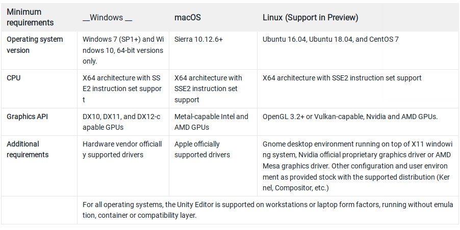

En general, es demana targeta gràfica amb suport de DirectX10 (Shader Model 4.0) per a Windows; OpenGL 3.2 o superior en Linux, i processador amb el joc d'instruccions SSE2.

## Creació d'un compte en Unity ID

Per tal de treballar amb Unity necessiteu disposar d'un compte d'usuari, al qual, també vincularem serveis i compres o descàrregues que realitzem.

Els passos a seguir per crear el nostre compte són:

1. Accedim a la web https://id.unity.com, i ens registrem, bé mitjançant el link corresponent o bé vinuclant el compte de Unity al nostre compte amb Google, Facebook o Apple.

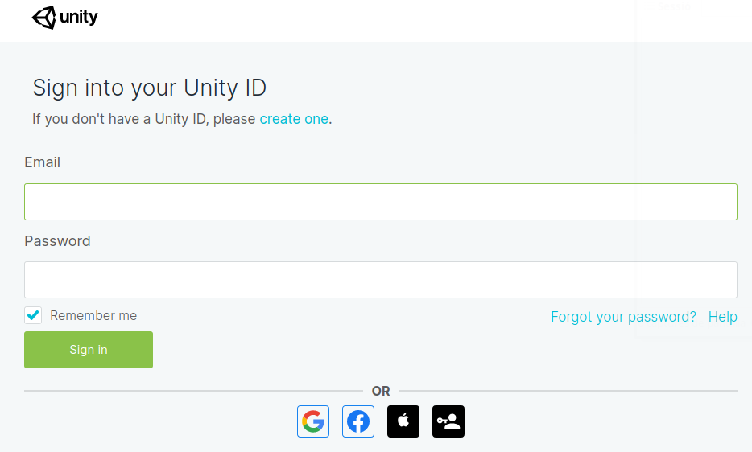

2. Una vegada completat el registre, acceptem els termes i la política de privacitat.

3. Fet açò, accedirem ja al nostre espai a la plataforma de Unity. Inicialment, ens trobarem en la secció amb la informació del nostre compte (*My Account Settings*).

Tots els detalls del nostre compte, des de la informació personal, seguretat, etc. ho podem gestionar des de [https://id.unity.com/](https://id.unity.com/). 

Per altra banda, des del menú de la dreta, podem accedir al *Unity Dashboard*:

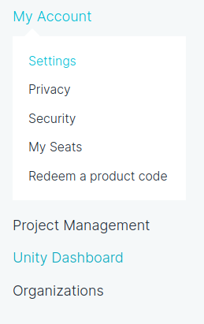

Que ens portarà al lloc web del nostre Dashboard: [https://dashboard.unity3d.com/landing](https://dashboard.unity3d.com/landing) des d'on gestionarem els nostres projectes.

## Unity Hub

Unity Hub és una eina que ens permet gestionar, de manera centralitzada, el nostre compte de Unity, les llicències i els nostres projectes i diferents instal·lacions (versions) de l'editor de Unity, junt amb els diferents mòduls d'aquest

### Descàrrega i instal·lació

Per tal de descarregar Unity Hub, ho farem a través de la secció de [descàrregues de la web de Unity](https://unity3d.com/es/get-unity/download), amb el botó *Descarga Unity Hub*:

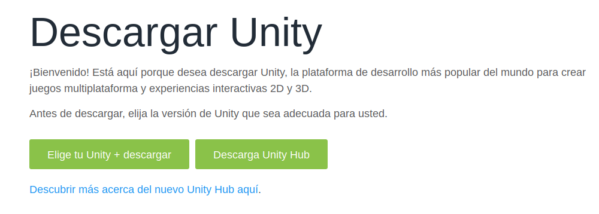

Per a Windows, disposeu d'un fitxer executable que realitza la instal·lació mitjançant un assistent.

Al cas de sistemes Linux, es tracta d'un fitxer de tipus autocontingut *AppImage*, de manera que només cal executar-lo i acceptar la llicència per accedir a l'aplicació. 

### Primers pasos amb Unity Hub

En iniciar-se ens dirigirà directament a la pantalla de gestió de llicències, ja que no tenim cap llicència instal·lada:

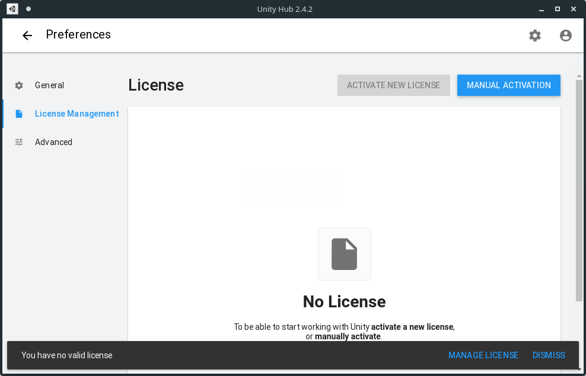

Per tal d'activar una llicència, hem d'estar logats amb el nostre usuari. Per a això, obrirem el menú de gestió del compte, ubicat a la part superior dreta i seleccionarem *Sign in*:

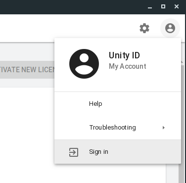

Una vegada finalitzat el procés d'autenticació, ja podem activar la nostra llicència. Veurem que també ha canviat el menú del nostre usuari, i des d'ell podrem realitzar diferents accions relacionades amb el nostre compte.

Com que ja estem logats, anem a poder activar una nova llicència. Per a això fem clic en el botó *Activate New License*, i seleccionem la llicència *Personal*, indicant que no som professionals del sector:

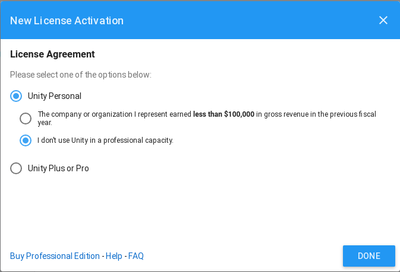

Amb la llicència acceptada, fem clic a l'opció *General* de les preferències, i aci podem editar el Path on s'intal·laran els diferents editors de Unity. Trieu un disc on tingueu bastant capacitat d'emmagatzemament, ja que els editors solen ser bastant pesats, i com més plataformes necessitem incrementen el seu pes.

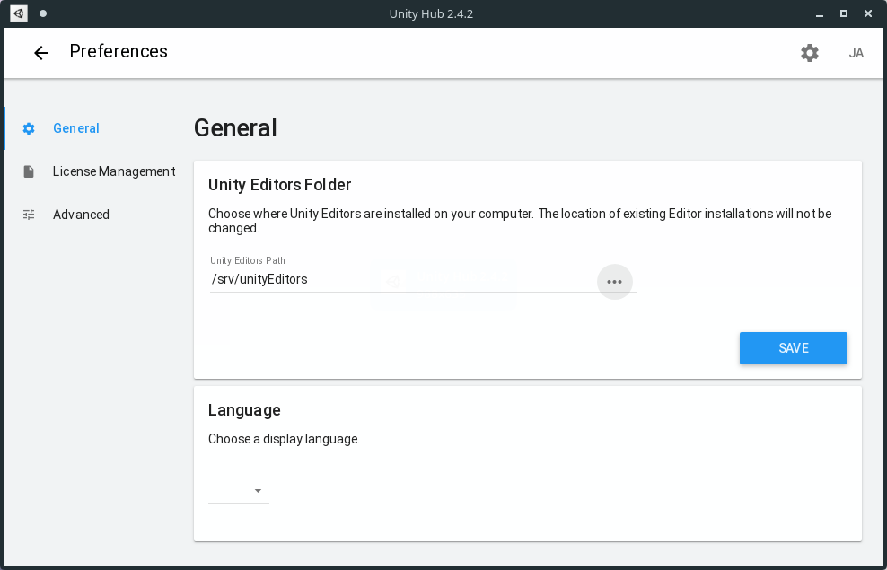

Per tal d'anar a la finestra principal de Unity Hub, farem clic en la fletxa d'anar enrere, ubicada a la part superior esquerra, al costat de Preferences. En aquesta finestra principal tenim quatre opcions:

* **Projects**, amb els nostres projectes, 
* **Learn**, amb diversos projectes i tutorials per aprendre,
* **Community**, amb enllaços a blogs i documentació de la comunitat de Unity, i
* **Installs**, des d'on gestionem les diferents versions de l'editor que tenim instal·lades.

### Instal·lant editors

Anem ara a instal·lar l'editor. Per a això, farem clic en el botó **Add**, per tal d'obrir la finestra de descàrregues:

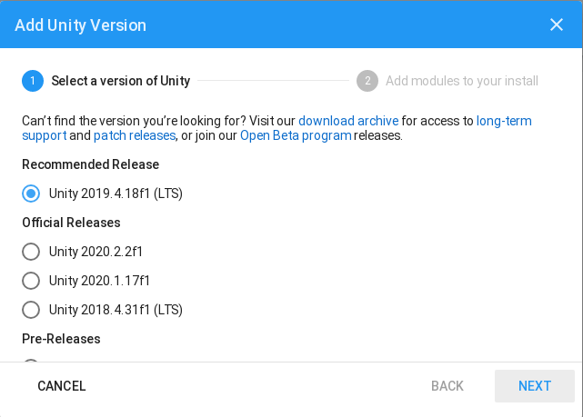

La instal·lació es divideix en dos pasos. En primer lloc seleccionarem la versió de Unity, i en segon els mòduls que volguem instal·lar.

En el primer pas, se'ns suggereix la instal·lació de la versió 2019.4.18f1, que és LTS, però que també tenim disponibles altres versions, tant oficials (LTS més antigues, o no LTS més modernes), i versions en versió pre-release. Seleccionarem aquesta opció proposada i fem clic en *Next*.

El segon punt de la instal·lació, ens dóna a triar entre diferents mòduls, o sistemes als què exportar els nostres projectes, la documentació i idiomes addicionals. Al nostre cas, seleccionem només la versió d'escriptori en què estem treballant (*Linux/Mac/Windows Build Support*). Si volem estalviar espai podem desmarcar la instal·lació de la documentació.

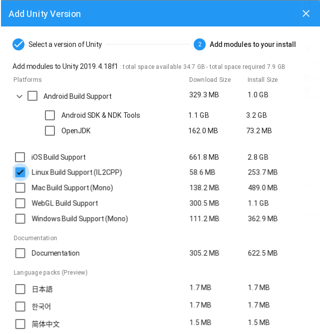

Una vegada seleccionat, fem clic en *Done* per començar la instal·lació. A la finestra d'*Installs* vorem una targeta amb la informació de la instal·lació i amb xicoteta barra a la part superior amb el progrés de la instal·lació.

Una vegada feta la instal·lació, podem afegir més mòduls, marcar com a predeterminada alguna instal·lació o desinstal·lar-les.

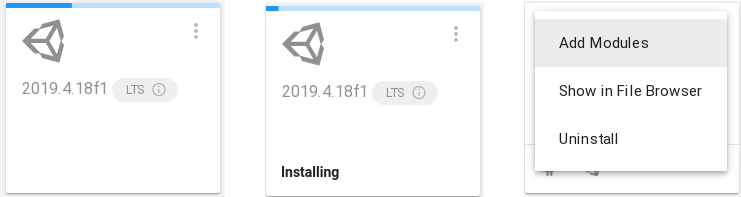

